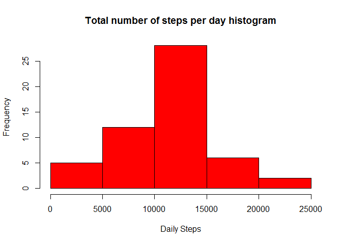
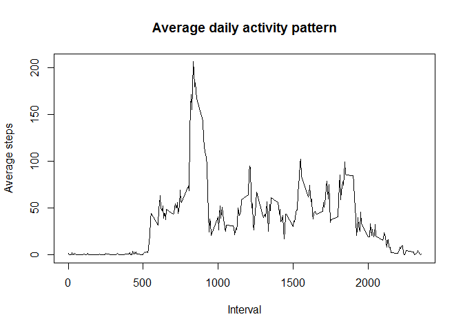
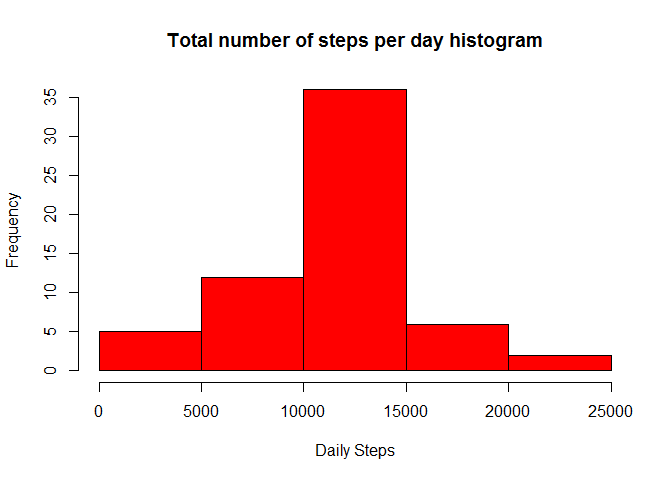
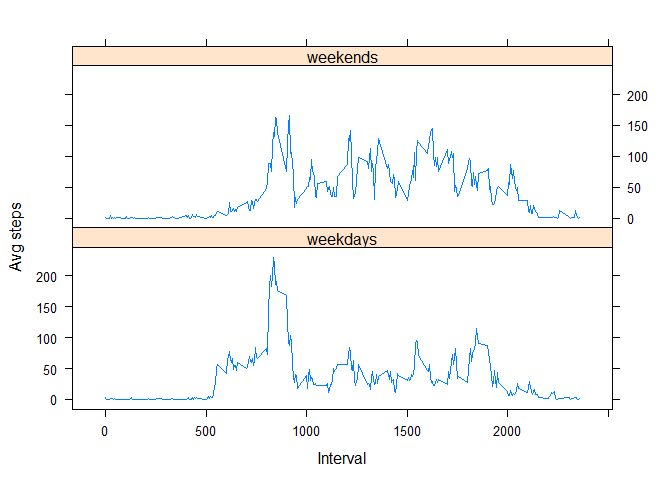

# Reproducible Research: Peer Assessment 1


## Loading and preprocessing the data

```r
activ<-read.csv("activity.csv")
```

## What is mean total number of steps taken per day?

```r
# Determine total number of steps per day
library(plyr)
daily_sum<-ddply(activ, .(date),summarize,tot_steps=sum(steps))

# Histogram plot of total number of steps per day
hist(daily_sum$tot_steps,col="red",main="Total number of steps per day histogram",xlab="Daily Steps")
```

\

```r
# Mean and median of total number of steps taken per day
mean_steps<-mean(daily_sum$tot_steps,na.rm=TRUE)
median_steps<-median(daily_sum$tot_steps,na.rm=TRUE)
```

The mean total number of steps per day is 10766.

## What is the average daily activity pattern?

```r
# Time series plot of average number of steps taken, averaged across all days, against the 5-minute interval 
step_sum<-ddply(activ, .(interval),summarize,avg_steps=mean(steps,na.rm=TRUE))
plot(step_sum$interval,step_sum$avg_steps,type="l",main="Average daily activity pattern",xlab="Interval",ylab="Average steps")
```

\

```r
# Which 5-minute interval, on average across all the days, contains the maximum number of steps
interval_max<-step_sum[which.max(step_sum$avg_steps),"interval"] 
```
The maximum number of steps contained in 5 minute interval number 835. 


## Imputing missing values

```r
# Calculate and report the total number of missing values in the dataset
num_missing_vals<-sum(is.na(activ$steps))
```
There are 2304 rows with missing (NA) values for steps.


```r
# Isolate complete set, without NA values
comp_set<-activ[complete.cases(activ$steps),]

# Determine missing set, with NA values
miss_set<-activ[is.na(activ$steps),c("interval","date")]

# Average interval steps across all days to be used to substitute missing values
step_sum<-ddply(activ, .(interval),summarize,steps=mean(steps,na.rm=TRUE))
updated_set<-merge(miss_set,step_sum,by.x="interval",by.y="interval",all.x=TRUE)

# Create a new dataset that is equal to the original dataset but with the missing data filled in
activ_new<-rbind(comp_set,updated_set)

# Determine total number of steps per day for new set
daily_sum_new<-ddply(activ_new, .(date),summarize,tot_steps=sum(steps))

# Histogram plot of total number of steps per day
hist(daily_sum_new$tot_steps,col="red",main="Total number of steps per day histogram",xlab="Daily Steps")
```

\

The above histogram is based on new dataset with missing values imputed by substituting NA values with average value over all days per interval. 


```r
# Mean and median of total number of steps taken per day
mean_steps_new<-mean(daily_sum_new$tot_steps,na.rm=TRUE)
median_steps_new<-median(daily_sum_new$tot_steps,na.rm=TRUE)
```

The impact of this is that the mean number of steps shift from 10766 to  10766.

## Are there differences in activity patterns between weekdays and weekends?

```r
# Create a new factor variable in the dataset with two levels - "weekday" and "weekend" 
activ_new$weekfac<-ifelse(weekdays(as.Date(activ_new$date),abbreviate=TRUE) %in% c("Sat","Sun"),"weekends","weekdays")

# Average number of steps taken, averaged across all days, against the 5-minute interval and factor variable created
step_sum_new<-ddply(activ_new, .(weekfac,interval),summarize,avg_steps=mean(steps,na.rm=TRUE))

# Time series plot of average number of steps taken, averaged across all days, against the 5-minute interval
library(lattice)
p<-xyplot(avg_steps ~ interval | weekfac, data=step_sum_new, layout = c(1, 2), type="l", xlab="Interval",ylab="Avg steps")
print(p)
```

\
